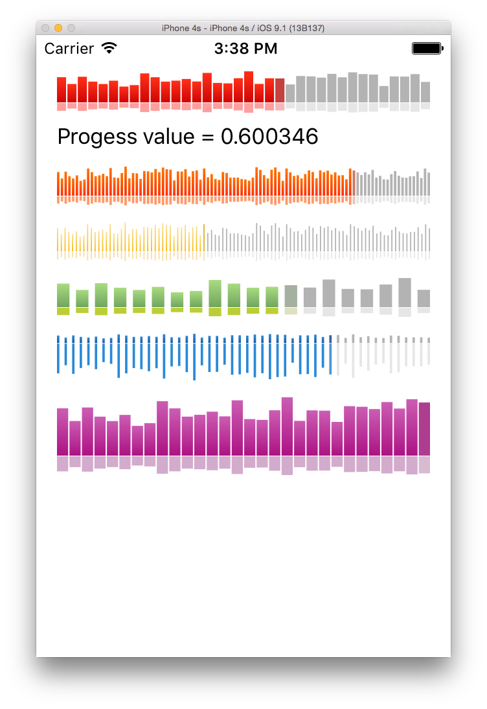

# ProgressTrack
A progress track like the one used in SoundCloud.com

## Screenshots



## Usage

### Basic usage

Add ProgressTrack.swift into your project.

```swift
import UIKit

class ViewController: UIViewController, ProgressTrackDelegate {    
    @IBOutlet var progressTrack1: ProgressTrack!
    
    override func viewDidLoad() {
        super.viewDidLoad()
        
        progressTrack1.trackData = [0.2, 0.3, 0.8, 0.7, 0.6, 0.7, 0.8, 0.9, 1.0, 0.8, 0.4, 0.1]
        progressTrack1.delegate = self
    }

    func progressTrackBarTappedUp(progressTrack: ProgressTrack, fromProgressValue: Float, toProgressValue: Float) {
        let fromBarIndex = progressTrack.getBarIndexByProgressValue(fromProgressValue)
        let toBarIndex = progressTrack.getBarIndexByProgressValue(toProgressValue)
        
        let fromBarValue = progressTrack.trackData[fromBarIndex]
        let toBarValue = progressTrack.trackData[toBarIndex]
                
        print("barTapped fromBarIndex:[\(fromBarIndex)]=\(fromBarValue) toBarIndex:[\(toBarIndex)]=\(toBarValue) \(toProgressValue)")
    }
}
```

## Requirements

- iOS 7 or higher
- Automatic Reference Counting (ARC)

## Author

- [yalight](https://github.com/yalight)

## License

ProgressTrack is released under the MIT license. See the LICENSE file for more info.
